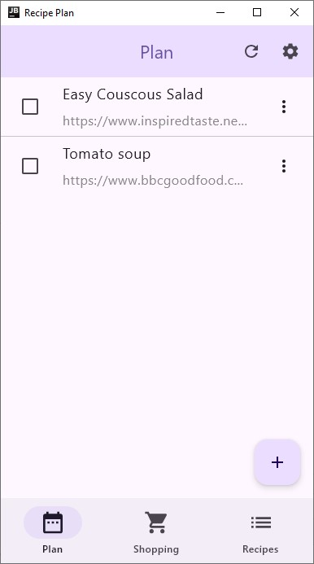
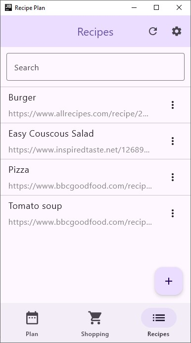

# Recipe Plan

Kotlin Multiplatform (Android, JVM) app for planning meals and saving recipes using Compose Multiplatform.

Data is synced with Google Sheets and can be shared with other users.

## Screenshots

## Features

- Sync data with Google Sheets and auth using Google Account
- Automatically fetch recipe name from URL
- Share to [Bring](https://www.getbring.com/en/home) to add ingredients to shopping list

## How to run yourself

- For auth, create a project in the [Google Cloud Console](https://console.cloud.google.com).
- Enable the Google Sheets API

### JVM

- Create a Desktop OAuth 2.0 Client ID
- Download the credentials.json and place it in `composeApp/src/jvmMain/resources/`
- Open in IntelliJ IDEA and run `composeApp/src/jvmMain/kotlin/de/rakhman/cooking/main.kt` 

### Android

- Create an Android OAUth 2.0 Client ID using the package name `de.rakhman.cooking` and your keystore's SHA1 fingerprint ([tutorial](https://developers.google.com/android/guides/client-auth))
- Open in IntelliJ IDEA or Android Studio and run

## Code

* `/composeApp` is for code that will be shared across your Compose Multiplatform applications.
  It contains several subfolders:
  - `commonMain` is for code that’s common for all targets.
  - Other folders are for Kotlin code that will be compiled for only the platform indicated in the folder name.
    For example, if you want to use Apple’s CoreCrypto for the iOS part of your Kotlin app,
    `iosMain` would be the right folder for such calls.

The app uses [Compose Hot Reload](https://github.com/JetBrains/compose-hot-reload).

Learn more about [Kotlin Multiplatform](https://www.jetbrains.com/help/kotlin-multiplatform-dev/get-started.html)…